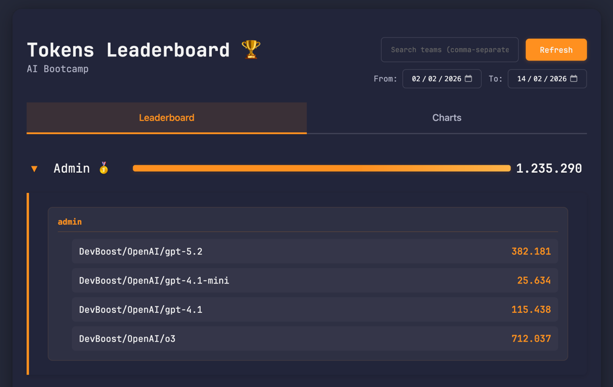

# Hands-On: Context Engineering using Conductor

## Prerequisites

### Obtain your API Key

Run the following command and follow the instructions:

```bash
./get-api-key.sh YourFirstName YourLastName
```

### Start the Application

```bash
# backend
cd backend
uv run python app.py

# frontend
cd frontend
npm run dev
```

now you can visit the frontend via [https://workshop.devboost.com](https://workshop.devboost.com) -> `Frontend`



--- 

## 📋 Task Description

Currently, we don't now about the total number of spent tokens for each model. 

Therefore, a draft frontend implementation already exists with the backend returning a static response `Dummy Model` with `10000` tokens.

The full backend implementation is still missing and should return all models with the aggregated tokens among all users.


---

## Claude Code & Conductor

### Running Claude Code

```bash
# in terminal
claude
```

### Using Conductor
- [https://github.com/fcoury/conductor](https://github.com/fcoury/conductor)

Conductor is an AI coding assistant extension that enables Context-Driven Development. It turns your AI assistant into a proactive project manager that follows a strict protocol to specify, plan, and implement software features and bug fixes.

Instead of just writing code, Conductor ensures a consistent, high-quality lifecycle for every task: Context -> Spec & Plan -> Implement.

Commands overview:

```bash
# in Claude Code
/conductor:setup - Initialize project context and scaffolding
/conductor:new-track - Create a new track with spec and plan
/conductor:implement - Execute tasks from the current track
/conductor:status - Summarize current progress
/conductor:revert - Git-aware revert of tracks, phases, or tasks
```

> `/conductor:setup` has alredy been executed and steering documents have been generated for you.
> These context files are then used for building new components or features by you or anyone on your team.

Generated Artifacts:

```bash
task/
└── conductor/
    ├── product.md              # Product vision and goals  (e.g. users, product goals, high-level features)
    ├── product-guidelines.md   # Brand and design standards (e.g. prose style, brand messaging, visual identity)
    ├── setup_state.json        # Resume capability state
    ├── tech-stack.md           # Technology choices (e.g. language, database, frameworks)
    ├── workflow.md             # Development methodology (e.g. TDD, commit strategy)
    └── code-styleguides/
        ├── general.md          # General coding styleguide
        ├── python.md           # Python language styleguide
        ├── javascript.md       # JavaScript language styleguide
        └── typescript.md       # TypeScript language styleguide
```

## Create an implementation plan for a new feature

```bash
# in claude code
/conductor:new-track
```

This will prompt you a few suggestions for a new feature to implement. You have also the option to enter your own idea. 
Describe what you wan't to achieve from above and follow the instructions. You can also play around with some instructions:

- "ask me exactly 5 questions about the feature.."
- "implement that feature and use the integration test `backend/tests/test_tokens_models_endpoint_integration.py` to verify your work.."
- "make the substeps as small as possible and testable for the user.."
- "give me your implementation strategy as diagram first.."

The process should finish with having created the following files:

```bash
task/
└── conductor/
    ├── ...
    └── tracks/
        └── <track_id>/
            ├── spec.md         # Requirements specification
            ├── plan.md         # Implementation plan
            └── metadata.json
```

## 🔍 Review the specs & plan

- how does the implementation plan look like?
- are the requirements covered?
- what about tests?
- commiting strategy?

Here you can refine the requirements and plan further as you like and introduce some backpressure already to the implementation plan to guide the model within some boundaries (e.g. predefined tests).

## Implement the created plan

Implement: Implement the feature step-by-step.

```bash
# in claude code
/conductor:implement
```

Check status: Get a high-level overview of your project's progress.

```bash
# in claude code
/conductor:status
```

Revert work: Undo a feature or a specific task if needed.

```bash
# in claude code
/conductor:revert
```
