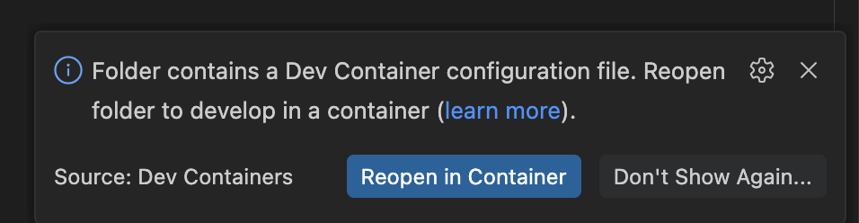
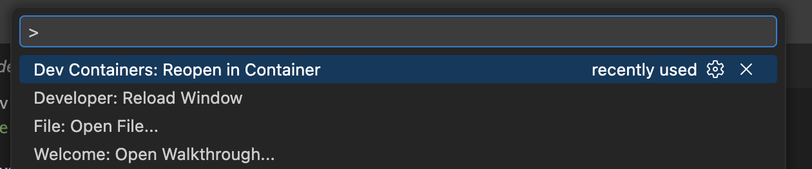

# Interactive Session | CodeBuzz 2026

#### Beyond Vibe Coding: Spec-driven Development auf dem Prüfstand

Vibe Coding ist derzeit in aller Munde, und Tools wie Lovable oder Base44 scheinen alles zu bieten, was man dafür braucht: ein schmales Texteingabefeld, ein paar gut formulierte Prompts – und schon entsteht ein neues Produkt.

Was auf der grünen Wiese noch gut funktioniert, sieht im Alltag von Entwickler:innen jedoch oft ganz anders aus. Legacy-Codebasen mit mehreren Millionen Zeilen Code, Backends, die sich über ein Dutzend Microservices erstrecken, sowie kollaboratives Arbeiten erschweren den Einsatz von KI-Coding-Tools erheblich. Schnell landet man im Chaos – und bei kostspieligen Rollbacks.

Im vergangenen Jahr hat sich deshalb die Idee des Spec-driven Development verbreitet. Tools wie beispielsweise Kiro (die IDE von Amazon) versprechen: „your best work by bringing structure to AI coding with spec-driven development“. Die zugrunde liegenden Ansätze sind vielversprechend – in der praktischen Umsetzung fehlt es jedoch oft an Alltagstauglichkeit.

Diese Hands-on-Session bietet eine Einführung in Spec-driven Development anhand eines beispielhaften Coding-Szenarios. Die Teilnehmenden lernen die Vor- und Nachteile selbst kennen und erfahren, was nötig ist, um die Abläufe effizienter zu gestalten. Dabei werden verschiedene Tools miteinander verglichen und ein Blick über den Tellerrand gewagt: Wie könnte die Schnittstelle zwischen Mensch und KI beim Coding in Zukunft aussehen?

### Key Takeaways

* die Grenzen und Herausforderungen von Vibe Coding
* wichtige Tools und Ansätze des Spec-driven Development
* praktische Tipps & Werkzeuge, die Teilnehmende direkt in ihren Arbeitsalltag integrieren können

---

## Inhaltsverzeichnis

<!-- TOC -->

* [Voraussetzungen](#voraussetzungen)
* [0. Vorbereitung](#0-vorbereitung)

  * [0.1 Devcontainer einrichten](#01-devcontainer-einrichten)
  * [0.2 Devcontainer starten](#02-devcontainer-starten)
  * [0.3 API-Key beziehen](#03-api-key-beziehen)

<!-- TOC -->

## Voraussetzungen

* Docker
* VS Code (unter Windows wird empfohlen, nicht WSL zu verwenden)
* [Dev Containers Extension](https://marketplace.visualstudio.com/items?itemName=ms-vscode-remote.remote-containers)

## 0. Vorbereitung

### 0.1 Devcontainer einrichten

Lade die Secrets und Umgebungsvariablen herunter von:

* [https://secrets.devboost.com/en/p/brj9virxjkrjbvq7hdm/r](https://secrets.devboost.com/en/p/brj9virxjkrjbvq7hdm/r)

und füge sie in die Datei `.devcontainer/devcontainer.env` ein.

### 0.2 Devcontainer starten

<u>Option 1:</u> VS Code erkennt den `.devcontainer`-Ordner automatisch und schlägt vor, das Projekt im Container erneut zu öffnen.



<u>Option 2:</u> Du kannst das Projekt manuell neu im Container öffnen, indem du in der oberen Suchleiste von VS Code folgenden Befehl eingibst:

```text
> Dev Containers: Reopen in Container
```



### 0.3 API-Key beziehen

Sobald du dich im Devcontainer befindest, öffne ein neues Terminal und führe folgenden Befehl aus, um deinen API-Key für Claude Code zu erhalten:

```bash
./get_api_key.sh Vorname Nachname
```

Folge den Anweisungen des Skripts – und schon bist du bereit für die Session! 🎉

Am Tag der Konferenz update ich die `README.md` & die Modelle in der `devcontainer.json`, die ihr euch einfach dann pullen könnt, bevor es losgeht.

Bis Dienstag!
